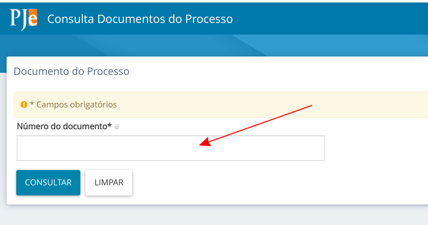

# Como disponibilizar chaves de acesso aos documentos

1. No modelo de documento, utilizar as variáveis:

        #{processoTrfHome.tabelaHashDocumentosComId}
         
    **OU:**

        #{processoTrfHome.tabelaHashDocumentos}

2. Ao minutar o documento, será incluída uma tabela com a lista de documentos do processo e suas respectivas chaves de acesso, exemplo:

    

3. Com as chaves, o usuário pode conferir o conteúdo de cada um dos documentos na página abaixo (troque o endereço para o seu Tribunal):

    [https://pje.tre-ba.jus.br:8443/pje-web/Processo/ConsultaDocumento/listView.seam](https://pje.tre-ba.jus.br:8443/pje-web/Processo/ConsultaDocumento/listView.seam)

    