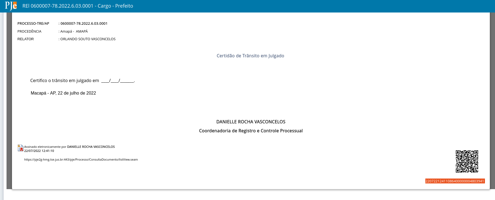

# Intimação com link para acesso ao documento do processo

Ao construir a intimação que fará referência ao documento "Representação atual", escreva um texto nesses moldes:

- Início do texto

Para acessar a "Representação atual", clique no link [https://pje.tre-ba.jus.br:8443/pje-web/Processo/ConsultaDocumento/listView.seam](https://pje.tre-ba.jus.br:8443/pje-web/Processo/ConsultaDocumento/listView.seam) e informe o código de acesso a seguir:

xxxxxx

- Final do texto

Esse valor xxxxxx deve ser recuperado a partir do próprio documento "Representação atual". Ao abrir a tela dos autos, opção Documentos, clique no ícone de exibição do documento assinado.

Ao clicar no ícone, o documento é exibido. A chave de acesso está registrada no final do documento.

# Como disponibilizar chaves de acesso contendo todos os documentos do processo

1. No modelo de documento, utilizar as variáveis:

        #{processoTrfHome.tabelaHashDocumentosComId}
         
    **OU:**

        #{processoTrfHome.tabelaHashDocumentos}

2. Ao minutar o documento, será incluída uma tabela com a lista de documentos do processo e suas respectivas chaves de acesso, exemplo:

    

3. Com as chaves, o usuário pode conferir o conteúdo de cada um dos documentos na página abaixo (troque o endereço para o seu Tribunal):

    [https://pje.tre-ba.jus.br:8443/pje-web/Processo/ConsultaDocumento/listView.seam](https://pje.tre-ba.jus.br:8443/pje-web/Processo/ConsultaDocumento/listView.seam)

    
