# Recursos internos

Quando opostos/interpostos/apresentado agravo regimental, embargos de declaração, recurso extraordinário, agravo, impugnação ao registro e notícia de inelegibilidade não há alteração na numeração do processo.  Não obstante, o processamento desses recursos/incidentes é realizado de forma diversa,  com partes de tipos diversos, decisões e julgamentos exclusivos do recurso. Além disso, é primordial para análise dos recursos identificar qual a origem do recurso, ou seja, se a parte está recorrendo de uma decisão do processo ou de uma decisão relacionada a outro recurso. 

Descreveremos aqui o mecanismo utilizado no PJe para que esse registro seja realizado de forma a permitir o tratamento diferenciado que a oposição/interposição requer. 

## Classes

Os recursos internos, apesar de serem opostos/interpostos por meio de documentos, são mapeados diretamente em classes processuais disponíveis nacionalmente no [Sistema de Gestão de Tabelas Processuais Unificadas](https://www.cnj.jus.br/sgt/consulta_publica_classes.php).

Sendo assim, ao serem registrados os recursos internos, o sistema fará a identificação por meio de uma nova capa processual vinculada ao mesmo número de processo e classe vinculada ao recurso correspondente. Vejamos um exemplo na consulta processual de uma Ação Cautelar com um recurso interno vinculado:

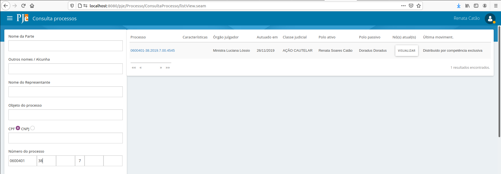

Com a devida permissão, o usuário pode pesquisar outras capas vinculadas ao processo. Essa opção vem desmarcada por padrão, mas no caso de querer visualizar separadamente a capa do recurso, o usuário pode selecionar a opção "Incluir recursos internos" na pesquisa.

Veja o resultado da consulta:

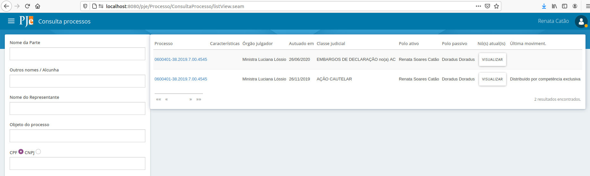

Ao selecionar qualquer das opções, o sistema exibirá todo o conteúdo do processo, mas a "capa", ou seja, o cabeçalho superior dos autos será exibido de acordo com a seleção. Veja os autos com a capa original do processo:

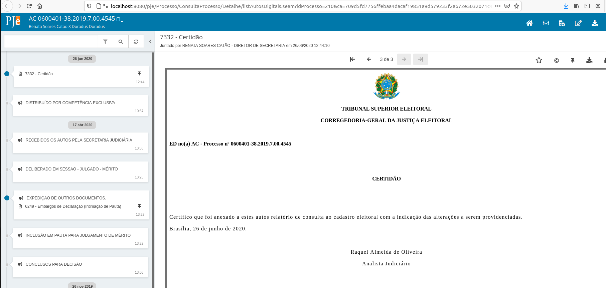

Veja agora os autos com a capa processual gerada para o recurso:

Sendo assim, o PJe precisa estar com a configuração da classe Embargos de declaração como recurso interno para que seja possível registrar o recurso correspondente. Essa configuração já está feita por padrão. Colocamos aqui a informação para que o usuário saiba qual o impacto em alterar. A configuração da classe correspondente por meio do menu Configuração - Tabelas Judiciais - Classe Judicial - Classe Judicial deve estar assim:

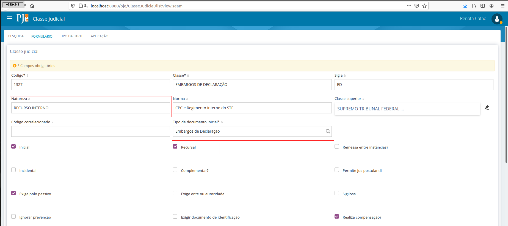

Perceba que as informações importantes para o registro do recurso estão destacadas. Ou seja, a classe tem que ter como Natureza "RECURSO INTERNO", deve estar marcada como recursal e deve ter o tipo de documento inicial correspondente vinculado.

## Como é iniciado um recurso interno

Via de regra, o recurso é oposto/interposto quando o usuário externo (advogado, procurador, parte) inclui um novo documento expondo seu pleito. O documento, se classificado corretamente pelo usuário na oposição/interposição, terá o tipo correspondente à classe recursal interna. Ou seja, se o advogado, por exemplo, quer recorrer por meio de Embargos de Declaração em uma Ação Cautelar, ele deve selecionar, na tela correspondente, o tipo de documento Embargos de Declaração. Veja a tela de inclusão de documentos que o advogado tem acesso:

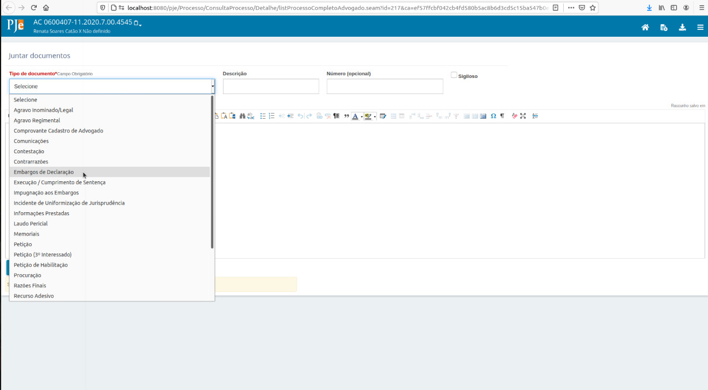

Ele deve selecionar a opção Embargos de Declaração para opor o recurso correspondente. Ao finalizar a inclusão do documento, é iniciada uma tarefa "Registrar recurso" para que o servidor faça o registro.

Veja que a tarefa ser iniciada é resultado de uma configuração no tipo de documento. Conforme pode-se verificar abaixo, o tipo de documento Embargos de declaração tem um "Fluxo associado". É o fluxo que contém a tarefa registrar recurso. O sistema entende, desse forma, que ao ser inserido um documento desse tipo, será iniciada uma tarefa.

E o que fazer quando o advogado protocola um documento que não iniciou a tarefa de recurso?

Ao analisar os autos do processo, o servidor percebe que o documento de petição inserido pelo advogado é na verdade um recurso oposto/interposto. 

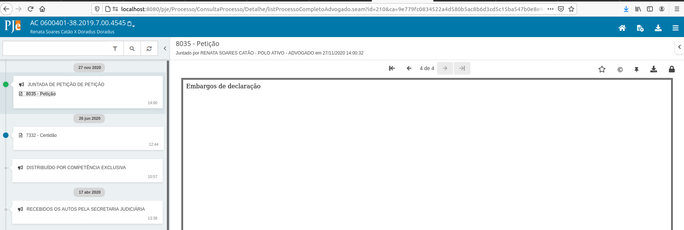

### Iniciar tarefa de recurso

O servidor deve, então, iniciar a tarefa de registro de recurso.

Essa possibilidade se dá a partir da tarefa "Analisar determinação"

A tarefa de registro de recurso é criada:

## Registrando um recurso

### Classificar recurso

O primeiro passo no registro do recurso é a classificação. Na classificação, o servidor pode selecionar qual o documento principal do registro e também se o recurso foi oposto/interposto para o processo originário ou para um outro recurso, caso já tenham sido registrados recursos para esse processo anteriormente.

A lista de recursos já registrados exibe todos os recursos já registrados pelo servidor. Cada item corresponde a uma capa processual a mais já gerada para o processo originário.

A lista de recursos não registrados exibe todos os documentos vinculados a classes recursais classificadas como "RECURSO INTERNO" e que não estão ainda vinculados a uma capa processual recursal. Em outras palavras, o advogado protocolou um documento de embargos, mas o servidor ainda não registrou o recurso.

Mas o advogado protocolou uma petição contendo um registro de embargos e não é exibida na lista de recursos não registrados. Por quê?

Porque o servidor precisa reclassificar esse documento. A reclassificação acontece na mesma tela. O servidor deve fazer essa reclassificação por meio do ícone de lápis disponível na coluna Ações do documento de petição correspondente:

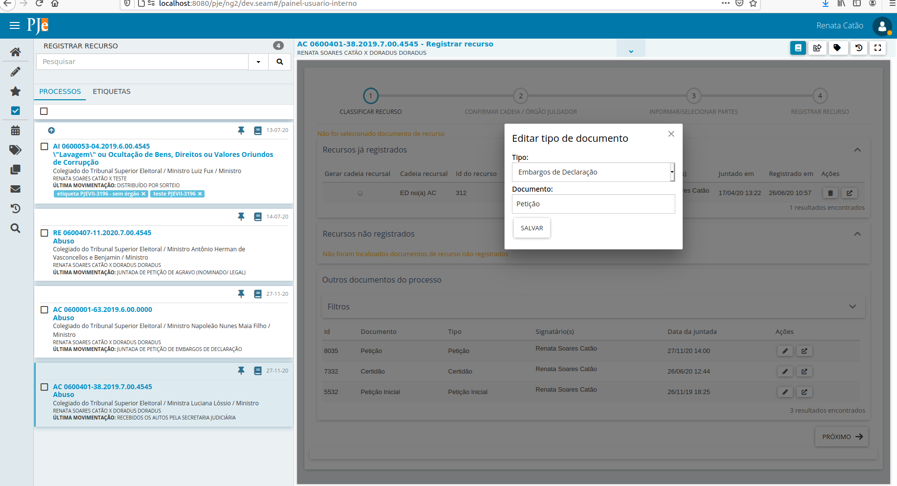

Ao selecionar salvar, veja que o sistema moverá o documento, que estava na lista "Outros documentos do processo" para a lista "Recursos não registrados":

Para o registro do recurso, é obrigatório que um item da lista "Recursos não registrados" esteja selecionado. Se o usuário tentar prosseguir sem a seleção, o sistema não permitirá, notificando que a seleção deve ser realizada:

### Confirmar cadeia / órgão julgador

O segundo passo no registro do recurso permite ao usuário confirmar como ficou a "Cadeia recursal" e alterar o órgão julgador de distribuição do recurso.

#### Cadeia recursal

A "Cadeia recursal" identifica, na forma de siglas ou nomes de classe encadeadas no cabeçalho da capa do processo, se o recurso tem como base uma decisão do processo ou uma decisão de outro recurso.

Observe o exemplo abaixo, em que o processo já tinha um recurso registrado. A tela mostra, em "Recursos já registrados", Embargos de Declaração já interpostos para o mesmo número do processo, ou seja, ED no(a) AC. 

Caso seja selecionado o recurso já registrado, o novo recurso será registrado com base no anterior, gerando a seguinte cadeia recursal:

Caso não seja selecionado o recurso já registrado, a cadeia terá apenas a classe do recurso novo e a classe do processo originário.

Por padrão, os cabeçalhos das capas processuais exibirão sempre a cadeia recursal com as siglas da classe, assim como já ocorre com o processo originário.

#### Alterar órgão julgador

Em alguns recursos, o julgamento do recurso terá como relator um órgão julgador diferente do originário do processo. Por exemplo, em Recursos Extraordinários interpostos no TSE, a competência do recurso é da presidência. O sistema permitirá que o usuário selecione um órgão julgador de distribuição do recurso diferente do órgão julgador originário do processo por meio dessa opção.

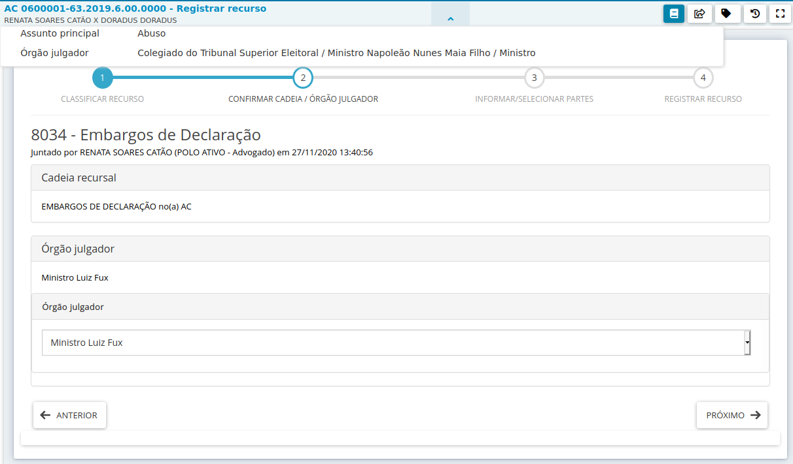

Se, no entanto, a seleção for equivocada e o usuário precisar ajustar, não há problemas. A possibilidade de se ajustar já no registro do recurso não impede ajustes posteriores, já que o recurso pode ser redistribuído a qualquer tempo, sem que isso resulte na redistribuição do processo originário ou dos outros recursos vinculados.

É válido salientar que a distribuição de recursos não impacta os pesos dos cargos.

### Informar / selecionar partes

O terceiro passo permite ao usuário informar as partes do recurso.

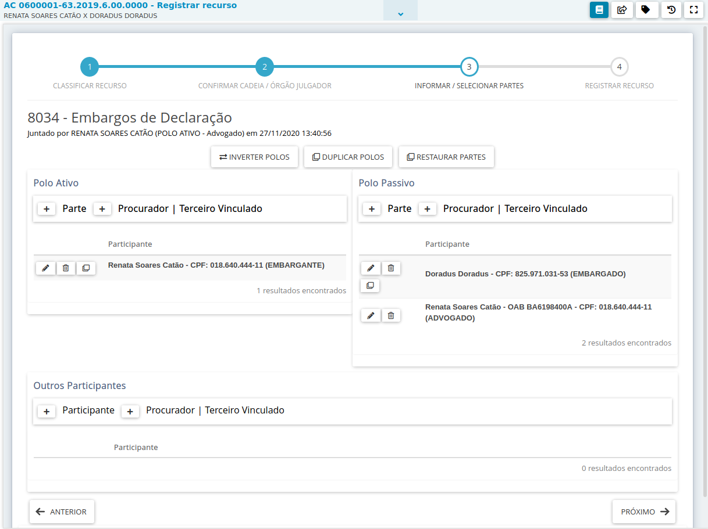

Observe que os tipos de parte do recurso são os tipos de parte vinculados à classe processual do recurso, como se pode verificar em Configuração - Tabelas Judiciais - Classe Judicial - Classe Judicial. 

O sistema fará a conversão automática das partes do processo nos tipos de parte principais vinculados à classe do recurso, mas o usuário poderá alterar os tipos, assim como acrescentar ou remover partes e seus representantes.

### Registrar recurso

No quarto e último passo, o usuário pode verificar o resumo das informações do recurso e selecionar a finalização do registro. 

Observe que, a qualquer tempo, a tarefa pode ser finalizada sem que o registro do recurso tenha sido concluído. 

Não há prejuízo algum. Se a finalização da tarefa for selecionada erroneamente, pode-ser iniciar um novo registro, conforme já descrevemos [anteriormente](https://pjeje.github.io/dicas/recursos/#iniciar-tarefa-de-recurso).

Ao selecionar "Cadastrar recurso", o sistema envia o recurso cadastrado para a primeira tarefa do fluxo vinculado à classe recursal, como se pode verificar em Configuração - Tabelas Judiciais - Classe Judicial - Classe Judicial.

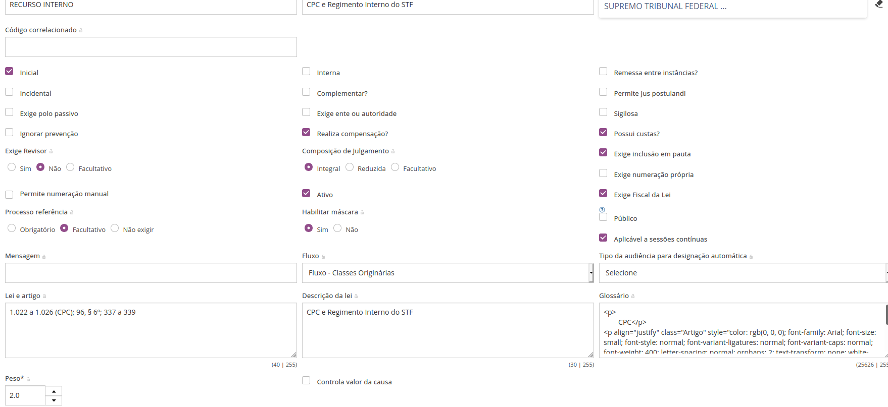

O recurso estará disponível, então, em "Analisar Processos" (estamos trabalhando na alteração da imagem abaixo). 

## Tramitação dos recursos e do processo originário

Os recursos tramitam internamente de forma independente do processo originário. Isso significa que o processo originário pode estar, por exemplo, em "Analisar determinação", e os embargos estão em "retificar dados do processo". 

Veja o exemplo abaixo. Foi utilizado o número do processo para consultar o processo nas tarefas. Como o perfil utilizado tem acesso a todas as tarefas, o sistema exibe o processo nas quatro tarefas abertas para ele.

Ao entrar em cada um dos resultados, o usuário verá que o processo principal foi julgado e estão abertas suas tarefas de elaborar extrato da ata e de revisar acórdão, mas já há um recurso registrado (tarefa analisar determinação) e há um novo fluxo de recurso iniciado para o processo principal (tarefa registrar recurso). Observe que a classe processual do cabeçalho na tarefa de acórdão aponta para o processo originário.

Da mesma forma, o cabeçalho do processo na tarefa "Analisar Processos" aponta para o recurso.

Essa tramitação apartada é muito importante para que possam ser feitos os cumprimentos de acordo com a decisão terminativa respectiva. Mesmo com a tramitação apartada, os autos digitais estão com todas as informações do processo. Observe abaixo: o cabeçalho é do recurso, mas a intimação de pauta feita quando o processo originário foi a julgamento está disponível.

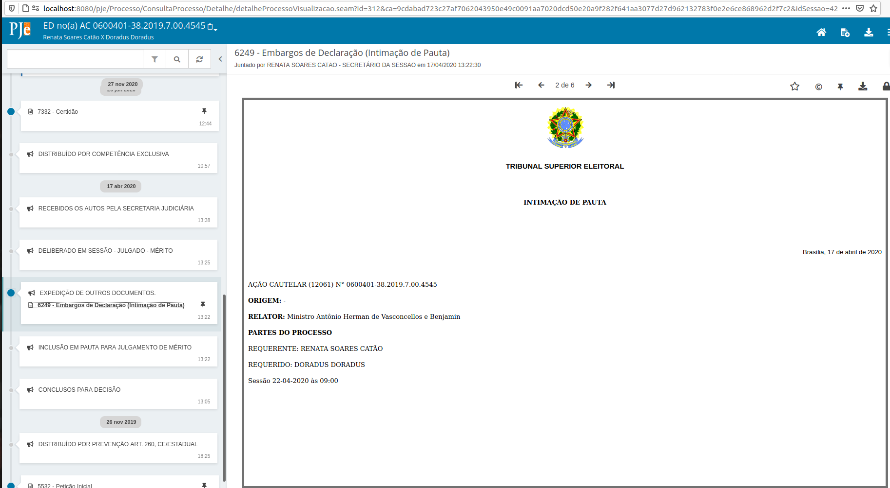

Quando o usuário quiser pautar o recurso em uma sessão de julgamento, a diferenciação também se dará pela classe no cabeçalho do processo. Veja abaixo que estamos pautando o recurso:

A intimação do recurso também é diferenciada, já que abrange a classe e as partes correspondentes:

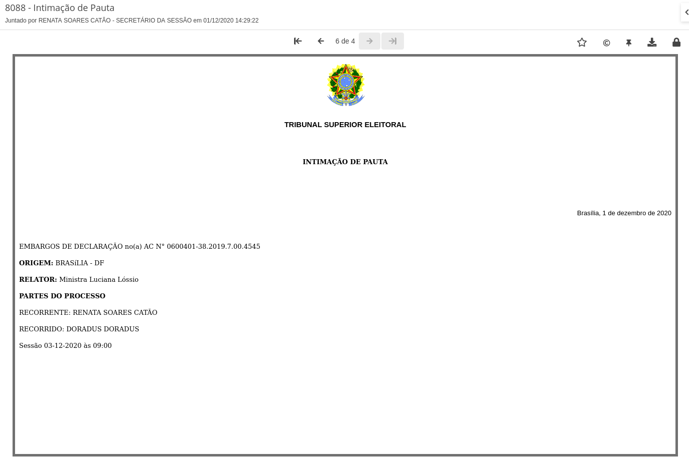

## Recursos e Etiquetas

A partir da versão que subiu dia 02/03 quando um caderno processual for criado, as etiquetas do processo principal serão replicadas. Agora, se o caderno for criado a partir de outro caderno, exemplo: embargos de declaração nos embargos de declaração na Classe XXXX, as etiquetas a serem vinculadas serão as dos embargos de declaração. Ou seja, as etiquetas serão importadas do processo/caderno no qual está sendo apresentado o recurso (respeitando a cadeia recursal).

As inserções e exclusões de etiquetas em ato posterior à criação do caderno, não surtirão efeitos nos demais cadernos ou feito principal.

## Observações

Ressaltamos alguns comportamentos:

- A consulta pública deve recuperar sempre o processo originário, exibindo as informações de movimento e documentos dos cadernos recursais conforme regras já existentes relacionadas à publicidade das informações.
- A remessa de processos envia todos os cadernos processuais (envia o processo principal com as informações dos cadernos) . As consultas do MNI devem retornar apenas um processo por número, contendo todos os movimentos e documentos de todos os cadernos, inclusive os recursais, de acordo com regras pré-existentes nas consultas.
- Algumas alterações em cadernos processuais devem refletir em todos os vinculados, ou seja, se a alteração for no principal ou nos recursais, todos os vinculados ao principal serão afetados. São elas: alteração de características do processo - segredo, nível, visualizadores, prioridades, custas e pedido de liminar/antecipação de tutela, dados eleitorais, assunto e objeto.
- A alteração de classe não reflete em todos os cadernos.
- A redistribuição não reflete em todos os cadernos.
- A distribuição/redistribuição de recursos não gera novos pesos para o cargo que recebe o caderno.
- A inclusão de partes no processo originário e nos cadernos recursais não reflete em alterações fora do caderno alterado, já que as partes podem trocar de polo dependendo do caderno. No entanto, a inclusão de advogados deve sempre refletir em todos os cadernos de forma a manter as representações de acordo com a última atualização.

## Dúvidas mais frequentes sobre Recursos Internos:

1) O DJe e SJUR recuperarão os dados dos cadernos processuais?

Resposta:  Após algumas reuniões com a equipe negocial da Jurisprudência e  DJe, entendeu-se necessário refletir as informações  dos  cadernos processuais no SJUR e no DJe. Assim, o cabeçalho que sairá nas publicações e na jurisprudência corresponderá ao do caderno processual.

2) RESPE deve ou não gerar caderno processual? 

Resposta: O principal motivo da criação dos cadernos processuais é resolver alguns problemas relacionados à Sessão Plenária: a) PJe vinha atraindo voto de sessões passadas, relacionadas ao principal, enquanto o que estava em julgamento era o recurso; b) necessidade de alterar relatoria do processo para levar um embargos de declaração oposto em face do acórdão com redator  para  o acórdão (questão preliminar); c) facilitar a confecção de certidões de julgamento pelo Assessor de Plenário (cabeçalho correto, etc.).

Efetivamente, o RESPE não se enquadra nesses pontos e, sob o aspecto técnico, pode sim não passar pelo registro de recursos e ser tratado como um documento comum, sem gerar cadernos processuais.

Ocorre que a criação do caderno tem um outro benefício, que é a autuação correta (polo ativo, polo passivo, tipos de partes e relator correspondentes ao recurso). Como dito acima, o cabeçalho vai para o DJe e SJUR. 

Então, é uma questão de avaliar o custo-benefício.

3) Ao concluir um caderno processual ao gabinete (agravo, por exemplo), não é necessário encaminhar, também, o processo principal (salvo se houver algo do fluxo do principal);

4) A implantação dos cadernos processuais, apesar de resolver vários outros problemas (como indicado linhas acima, de forma exemplificativa), não resolve a questão dos autos suplementares. 

Finalizada a tramitação do caderno processual recomenda-se arquivá-lo. Aliás, recomenda-se arquivar todos os cadernos processuais antes da remessa. Não conseguirão trabalhar no caderno (dentro do TRE) enquanto o principal está no TSE. 

O que vem para o TSE é o principal (conforme consta acima).

A solução para os autos suplementares é outra e está em fase de testes e regulamentação própria.

5) A ASPJE, visando facilitar o trabalho dos Regionais, realizou a configuração dos seguintes recursos via script:

- recurso extraordinário (1348) (TSE);
- agravo em recurso extraordinário (1045) (TSE);
- embargos de declaração (1327) (TRE e TSE);
- agravo regimental (1321) (TRE/TSE);
- "Agravo" (1000) (TRE/TSE);
- Recurso Ordinário Eleitoral (TRE) (11550);
- Recurso Especial Eleitoral (TRE) (11549);
-  Agravo em Recurso Especial Eleitoral (TRE);
- Agravo em Recurso Extraordinário Eleitoral (TSE).

Caso o Regional entenda ser o caso de configurar outros recursos ou retirar alguma configuração atual, basta seguir as orientações de configuração constante do Dicas.

6) O tribunal que recebe várias petições de recurso interno de um mesmo tipo (vários pedidos de "Embargos de declaração", por exemplo) pode optar por registrar apenas um recurso. Para isso, basta selecionar apenas um dos documentos. Para o PJe e para o usuário externo, não há diferença entre os documentos selecionados. Se o servidor quer registrar um recurso apenas, ele só precisa de um documento. Se ele quer registrar vários, ele precisa de um documento para cada registro. O registro do recurso é útil para conseguir julgar o recurso de forma separada. Qual documento foi utilizado não vai interferir, já que todos os documentos estão sempre vinculados a todas as capas. Se preferir, o servidor pode também criar um novo documento (uma certidão, por exemplo) agrupando os conteúdos dos documentos. Juntado o documento, pode utilizar o documento criado no registro do recurso após reclassificá-lo com o tipo de recurso pretendido. Mesmo essa opção não terá impacto algum para o PJe, sendo apenas uma maneira de trabalhar escolhida pelo tribunal.

## Orientações para usuários administradores

O escopo das alterações dentro do PJe foi delimitado pela pendência https://www.cnj.jus.br/jira/browse/PJEII-21789.

### Quero configurar meu sistema para aceitar o recurso interno 

Vamos utilizar como exemplo a classe Embargos de declaração e assumir que a instalação já contém a classe configurada e o tipo de documento Embargos de declaração também configurado. 

O administrador deve acessar a configuração da classe processual Embargos de declaração e marcá-la como "Recursal" e adicionar a informação de natureza da classe como "RECURSO INTERNO". Deve-se vincular essa classe a um fluxo e cadastrar o tipo de documento da petição inicial com o tipo Embargos de declaração. O fluxo associado será, via de regra, o fluxo originárias. 

O administrador deve também se certificar que o tipo de documento Embargos de declaração pode ser submetido por usuários externos (vinculação Suficiente ao papel advogado). Além disso, deve-ser associar o fluxo FLX_REGISTRAR_RECURSO ao tipo de documento.

### Papeis para utilização dos recursos internos (permissões)

O sistema sempre se comportará de forma a exibir o caderno processual principal por padrão, salvo no painel do usuário e nas telas de sessão, que abrirão os autos relacionados ao caderno que estiver em utilização. Para que, na consulta processual, o usuário possa pesquisar todos os cadernos processuais, o usuário deve estar vinculado ao papel "pje:papel:pesquisaRecursoInterno". 

Na consulta processual, o sistema não retornará todas as capas por padrão. Para que seja o padrão retornar todas as capas, o usuário deve estar vinculado ao papel "pje:papel:retornaRecursoInterno".

A exclusão de uma capa poderá ser realizada pelo usuário que estiver vinculado ao papel "pje:papel:removeRecursoInterno".

O sistema exibirá, a partir dos autos digitais, a aba Recursos e Sessões que exibe todas as capas vinculadas àquele processo e sessões em que foram pautadas. A aba será exibida para o usuário vinculado ao papel "pje:papel:pesquisaRecursoInterno". 

### Regras negociais

- Caso não haja recursos protocolados, mesmo com a mudança estrutural, o sistema deve se comportar da mesma maneira que se comportava antes dessa pendência.
- Caso haja recursos, ou seja, uma entidade ProcessoTrf vinculada a um ProcessoTrf principal, a tramitação desse processo filho é independente do processo principal. Classe e partes também. O órgão julgador pode ser alterado de forma independente, mas, ao criar um recurso, o comportamento padrão é que o órgão julgador do recurso seja o mesmo do processo principal.
- Os movimentos e documentos do caderno processual do(s) recurso(s) também serão vistos nos autos do processo pai, assim como os movimentos e documentos do processo originário são visualizados na abertura dos autos do recurso. Todas as capas processuais vinculadas àquele número de processo exibirá os mesmos documentos e movimentos. A diferença nos autos é o cabeçalho processual, que exibe partes e cadeia recursal, conforme o caderno aberto dos autos.
- As abas dos autos exibem todas as informações relativas à capa principal.
- A abertura dos autos via tarefa, se o usuário está acessando uma tarefa onde o caderno processual recursal está em tramitação, exibirá o caderno recursal. Se o caderno da tarefa for o processo originário, os autos do processo principal serão abertos. 
- A oposição/interposição de recursos pode ser realizada a partir de uma tarefa de fluxo. Ela permite a interposição de recursos simplesmente, a interposição de recursos em recursos já tramitando, a reclassificação do documento principal, caso o usuário tenha pleiteado seu recurso por um tipo que não seja o da petição inicial, a seleção de qual documento recursal será a base do recurso, a confirmação da cadeia recursal, a seleção de órgão julgador, a alteração das partes e o registro do recurso. A possibilidade de alterar o tipo do documento registrado não deve listar documentos já vinculados a outros recursos como petição inicial ou ao próprio processo originário.
- Nos autos digitais, o menu de opções terá uma nova aba denominada "Recursos e sessões". Por meio dessa opção, o usuário visualizará as diversas capas vinculadas ao processo, se houver, e também informações sobre sessões em que as capas foram incluídas. A própria capa principal é sempre exibida, ainda que não haja recursos vinculados. 
 - A opção de remover recurso já registrado, disponível na tarefa de registro e na aba Recursos e Sessões dos autos do processo, fará com que os registros referentes ao recurso sejam apagados, e os documentos e movimentos do recurso sejam todos vinculados ao processo originário. Sendo assim, se houve um movimento de decisão lançado no recurso removido, ele continuará aparecendo nos autos do processo originário. Caso o recurso tenha acumulado muitas ações vinculadas a ele (expedientes, pauta em sessão, utilização como base em cadeia recursal), o cadastro do recurso não será removido, só os registros referentes à tramitação processual. Dessa forma, os documentos e movimentos permanecem vinculados à capa processual do recurso. À essa capa processual será acrescentada a situação processual "jus:arquivado", que deve ser exibida na consulta processual por meio do ícone de arquivo quando for o caso. Essa situação processual não se confunde com a tarefa de arquivamento. O arquivamento na Justiça Eleitoral só ocorre mediante lançamento de movimento específico apenas quando há a tramitação da capa principal para a tarefa de arquivo. O recurso também pode ser tramitado para a tarefa de arquivo, mas nesse caso, a tarefa fica com um nome diferente para permitir a diferenciação mais rápida por parte do usuário. Quando o recurso tramita para a tarefa de arquivo, nenhum movimento é lançado. 
 - **Não aconselhamos a utilização da remoção do recurso, já que o histórico de tramitação será todo perdido, caso isso ocorra. É uma opção que deve ser reservada apenas para administradores do sistema**;
 - O Arquivamento dos cadernos processuais ocorre em tarefa própria, denominada "Manter recurso arquivado". Por configuração de fluxo, o sistema identifica que o caderno sendo arquivado é um recurso interno e encaminha automaticamente para a tarefa respectiva;
 - O cabeçalho do processo exibido nos autos e no painel de tarefas deve refletir a cadeia recursal, quando houver;
 - A consulta pública deve recuperar sempre o processo originário, exibindo as informações de movimento e documentos dos cadernos recursais conforme regras já existentes relacionadas à publicidade das informações;
 - O DJe e SJUR recuperarão os dados dos cadernos processuais;
 - A retificação de autuação deve sempre abrir o processo originário; 
 - A tarefa de alterar partes exibirá as partes do processo para serem alteradas. A alteração de partes por meio dessa tarefa obedece às regras de retificação de partes na retificação da autuação. A alteração não gera movimento (Acesse instruções de configuração em [Alterações de fluxo para a Justiça Eleitoral](recursos.md#alteracoes-de-fluxo-para-a-justica-eleitoral) dentro do fluxo "CUMPRDET", tarefa "Alterar partes");
 - A tarefa de alterar órgão julgador exibirá órgãos julgadores disponíveis para alteração. A alteração não gera movimento (Acesse instruções de configuração em  [Alterações de fluxo para a Justiça Eleitoral](recursos.md#alteracoes-de-fluxo-para-a-justica-eleitoral) dentro do fluxo "CUMPRDET", tarefa "Alterar órgão julgador");
 - A remessa de processos envia todos as informações do processo principal e de todos os cadernos processuais. As consultas do MNI devem retornar apenas um processo por número, contendo todos os movimentos e documentos de todos os cadernos, inclusive os recursais, de acordo com regras pré-existentes nas consultas. Ao remeter um processo, todas as outras capas que por ventura ainda estejam tramitando ficam bloqueadas para tramitação e peticionamento, assim como já ocorre na remessa atualmente. NÃO É POSSÍVEL REMETER APENAS O RECURSO. Na remessa, assim como já ocorre antes dessa versãos dos recursos, o processo inteiro é remetido.Na instância de destino, é protocolado apenas uma capa; 
  - Algumas alterações em cadernos processuais devem refletir em todos os vinculados, ou seja, se a alteração for no principal ou nos recursais, todos os vinculados ao principal serão afetados. São elas: alteração de processo referência, alteração de características do processo - segredo, nível, visualizadores, prioridades, custas e pedido de liminar/antecipação de tutela;
- As alterações dos dados eleitorais, quando couber (processos da JE) devem refletir, da mesma forma, em todos os cadernos processuais;
- As alterações de assunto, objeto, dados criminais e impedimentos para magistrados em processo refletem em todos os cadernos;
- A distribuição/redistribuição de recursos não gera novos pesos para o cargo que recebe o caderno;
- A redistribuição não reflete em todos os cadernos;
- As tarefas de apensar, desmembrar, redistribuir e evoluir classe são inibidas por meio de fluxo de forma a evitar que sejam abertas para cadernos recursais;
- Os indicativos de prevenção que são exibidos em algumas tarefas não devem ser exibidos quando a tarefa exibir cadernos recursais; 
- A inclusão de partes no processo originário e nos cadernos recursais não reflete em alterações fora do caderno sendo alterado, já que as partes podem trocar de polo dependendo do caderno. No entanto, a inclusão de advogados deve sempre refletir em todos os cadernos de forma a manter as representações atualizadas de acordo com a última atualização após o registro do recurso. Isso significa que na tarefa de registro de recurso, como o recurso não está protocolado ainda, alterações nas representações não refletem nas outras capas;
- Se, ao finalizar o protocolo do recurso, a tarefa correspondente não for finalizada, o sistema não permitirá atuação novamente naquela tarefa. Caso o usuário atualize o painel e a tarefa seja recarregada após a finalização do protocolo do recurso sem que tenha sido finalizada, ele lançará uma mensagem sinalizando ao usuário que a tarefa deve ser encerrada.

### Alterações de fluxo para a Justiça Eleitoral

- FLX_REGISTRAR_RECURSO
       - Nas tarefas "Registrar recurso" e "Registrar recurso - Corregedoria", alterar as variáveis que estão nas duas para que referenciem o seguinte:Processo_Fluxo_Recurso_registrarRecurso no lugar de Processo_Fluxo_documento_recurso_registrarRecurso
       - Incluir no evento "Criar tarefa" das tarefas "Registrar recurso" e "Registrar recurso - Corregedoria" a ação #{taskInstanceUtil.setFrameDefaultTransition('Finalizar fluxo')}
       
- FLX_ORIGINARIAS       
	- Na tarefa "Verificar e Certificar dados do processo", alterar a expressão que consta na quarta ação em iniciar tarefa (a que contém "#{tramitacaoProcessualService.gravaVariavelTarefa('pageParam','idProcesso='.concat(tramitacaoProcessualService.recuperaProcesso().idProcessoTrf))}") para conter o seguinte: "#{tramitacaoProcessualService.gravaVariavelTarefa('pageParam','idProcesso='.concat(tramitacaoProcessualService.recuperaProcesso().processoTrfPrincipal.idProcessoTrf))}"  
	- Na tarefa "Definir procedimento", alterar transição "Redistribuir de ofício" e "Apensar e desapensar processos" para conter a condição "#{!tramitacaoProcessualService.recuperaProcesso().isRecursoInterno()}" 
	- Criar um nó de decisão de nome "Verifica recurso" que contenha a seguinte EL: "#{tramitacaoProcessualService.recuperaProcesso().isRecursoInterno() ? 'T1' : 'T2'}". Atribuir à transição "T1" o encaminhamento para "Cumprimento de determinações do ministro" e à transição "T2" o encaminhamento para "Processo com movimentação de magistrado?"
	- Substituir transição de saída do nó "Gravar variáveis de fluxo" de "Processo com movimentação de magistrado?" para "Verifica recurso"
	- Criar um nó de decisão denominado "Verifica recurso arquivo" que contenha a seguinte EL: "#{tramitacaoProcessualService.recuperaProcesso().isRecursoInterno() ? 'T1' : 'T2'}". Atribuir à transição "T1" o encaminhamento para "Fluxo de arquivo" e à transição "T2" o encaminhamento para "Realiza Baixa"
	- Alterar transições "T1" e "Realiza Baixa para arquivamento" disponíveis, respectivamente, nos nós "Testar encaminhamento ao arquivo" e "Verificar Pendências" para encaminhar para "Verifica recurso arquivo".
	- Criar um nó de decisão denominado "Verifica recurso reativa" que contenha a seguinte EL: "#{tramitacaoProcessualService.recuperaProcesso().isRecursoInterno() ? 'T1' : 'T2'}". Atribuir à transição "T1" o encaminhamento para "Verifica se é cumprimento da Corregedoria" e à transição "T2" o encaminhamento para "Reativa Processo"
	- Alterar transições "Reativa processo" disponível no nó "Fluxo de arquivo" para encaminhar para "Verifica recurso reativa".

- CUMPRDET
	- Nas tarefas "Analisar determinação", "Analisar processos", "Analisar Processos - Urgentes" e "Analisar determinação - Urgentes", alterar transições "Redistribuir processo", "Evoluir classe processual", "Apensar e desapensar processos" e "Desmembrar processos" para conter a condição "#{!tramitacaoProcessualService.recuperaProcesso().isRecursoInterno()}"	
	- Na tarefa "Confirma prevenção processual", alterar transição "Redistribuir processo" para conter a condição "#{!tramitacaoProcessualService.recuperaProcesso().isRecursoInterno()}" 
	- Na tarefa "Atualizar dados do processo", alterar a expressão que consta na quarta ação em iniciar tarefa (a que contém pageparam) para conter o seguinte: "#{tramitacaoProcessualService.gravaVariavelTarefa('pageParam','idProcesso='.concat(tramitacaoProcessualService.recuperaProcesso().processoTrfPrincipal.idProcessoTrf))}"
	- Acrescentar nó de tarefa cujo nome é "Alterar partes", disponível para raia "Secretaria Judiciária - Processamento", com  a seguinte variável do tipo "Frame": Processo_Fluxo_Recurso_alterarPartes. Acrescentar transição para a tarefa a partir das tarefas "Analisar determinação", "Analisar processos", "Analisar Processos - Urgentes" e "Analisar determinação - Urgentes" com condição de entrada "#{tramitacaoProcessualService.recuperaProcesso().isRecursoInterno()}" . Acrescentar transição de saída para o nó "testar encaminhado pelo Relator" com o nome de "Retornar". Na variável, a configuração de "Escrita" deve estar marcada e a configuração "Obrig." não deve estar marcada. 
	- Acrescentar nó de tarefa cujo nome é "Alterar órgão julgador", disponível para raia "Secretaria Judiciária - Processamento", com  a seguinte variável do tipo "Frame": Processo_Fluxo_Recurso_alterarOrgaoJulgador. Acrescentar transição para a tarefa a partir das tarefas "Analisar determinação", "Analisar processos", "Analisar Processos - Urgentes" e "Analisar determinação - Urgentes" com condição de entrada "#{tramitacaoProcessualService.recuperaProcesso().isRecursoInterno()}" . Acrescentar transição de saída para o nó "testar encaminhado pelo Relator" com o nome de "Retornar". Na variável, a configuração de "Escrita" deve estar marcada e a configuração "Obrig." não deve estar marcada. 

- FLX_ARQUIVO
	- Criar um nó de tarefa cujo nome é "Manter recurso arquivado" a atribuir à raia "Secretaria Judiciária". Criar uma transição de saída dessa tarefa para o "Término" com o nome de "Reativar recurso"
	- Criar um nó de decisão de nome "Verificar recurso" que contenha a seguinte EL: "#{tramitacaoProcessualService.recuperaProcesso().isRecursoInterno() ? 'T1' : 'T2'}"
	- Criar transição de saída para o nó de decisão chamada "T1" que encaminhe para a tarefa "Manter recurso arquivado" e transição de saída chamada "T2" que encaminha para o nó "Lançar Movimento de Arquivamento"
	- No nó de sistema "Apagar relator do processo", substituir a transição de saída para encaminhar para o nó de decisão "Verificar recurso"
	- Na tarefa "Classificar Processo para Arquivamento", colocar condição na transição "Registrar arquivamento" conforme a seguir: "#{!tramitacaoProcessualService.recuperaProcesso().isRecursoInterno()}"
	- Na tarefa "Classificar Processo para Arquivamento", acrescentar transição para "Manter recurso arquivado" com a condição conforme a seguir: "#{tramitacaoProcessualService.recuperaProcesso().isRecursoInterno()}"
	
### Alterações principais no relacionamento entre objetos e tabelas

A estrutura básica de processos judiciais do PJe tem uma entidade Processo e uma entidade ProcessoTrf, às quais são vinculados documentos, partes e movimentos. Antes da implementação dos recursos internos, para cada entidade Processo há uma ProcessoTrf correspondente. com os recursos internos, o relacionamento entre essas entidades é de um ou muitos ProcessoTrf para cada Processo existente. A entidade ProcessoTrf pode estar ou não vinculada a um processo pai, formando uma cadeia recursal. Dessa forma, pode-se ter recursos, que são cadernos processuais distintos, vinculados ao processo originário, assim como recursos vinculados a recursos. 

As querys feitas diretamente no banco de dados, assim como querys hibernates construídas dentro do PJe devem mapear esse novo comportamento. Para facilitar as consultas, foram adicionados campos no banco de dados sem normalização, evitando joins e o processamento mais pesado em determinadas consultas. 

As principais alterações serão relatadas por tabelas alteradas:

- tb_processo

A tabela tem o registro da última capa registrada em tb_processo_trf (cd_processo_status = 'D') relativa a esse processo.

- tb_processo_trf
 
A tabela contém:

O registro do processo originário (id_processo), referenciando a tabela tb_processo (sempre preenchido);

O registro da capa principal do processo (id_processo_trf_principal), referenciando a própria tb_processo_trf (sempre preenchido);

O registro da capa pai (id_processo_trf_pai), que pode existir ou não. Só existirá quando for um recurso do recurso;

A cadeia do recurso em forma de sigla (ds_classe_judicial_sigla). Se o campo não estiver preenchido, a recuperação é pelo campo sigla da classe da capa;

A cadeia do recurso por extenso (ds_classe_judicial_extenso). Se o campo não estiver preenchido, a recuperação é pelo campo de descrição da classe da capa

Um identificador de recurso interno (in_recurso_interno); 

A identificação da situação do processo (ds_nome_situacao_processual). As situações já existiam antes, mas foi replicada aqui para deixar a consulta mais rápida

- tb_proc_parte_expediente;

A tabela tem o identificador da capa principal, para otimizar os joins nas consultas de intimações para usuários externos (id_processo_trf_principal);

As triggers que alimentam tabelas de otimização de consultas (tb_cabecalho_processo e tb_processo_tarefa) foram alteradas para contemplar todas as alterações estruturais das tabelas de origem. As respectivas tabelas, assim como a tabela de documentos e a tabela de movimentos, foram alteradas para conter identifcação da capa a que se refere o registro; 

As tabelas tb_processo_instance e tb_proc_localizacao_ibpm foram alterados para conter a coluna id_processo_trf, correspondente ao caderno processual a que se refere o registro;

Algumas interfaces para uso de publicação no diário fazem referência ao campo idProcesso. Esse campo é preenchido no PJe e recebido no diário do tribunal, que faz consultas adicionais no banco do PJe, de acordo com a necessidade. Antes dos recursos, o PJe envia o idProcessoTrf referente ao expediente, que é igual ao idProcesso. Com os novos recursos, esses ids podem não coincidir. A implementação dos conectores com o diário deve ser revisada de acordo com essa observação.
