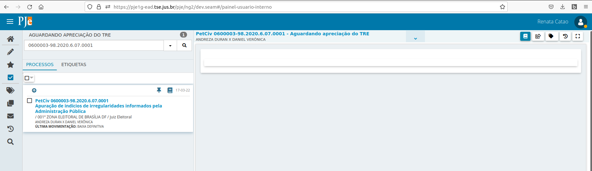
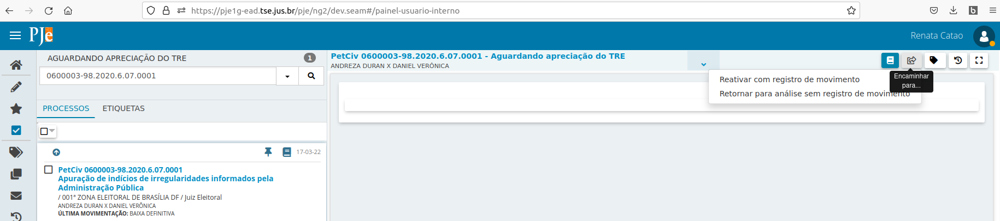
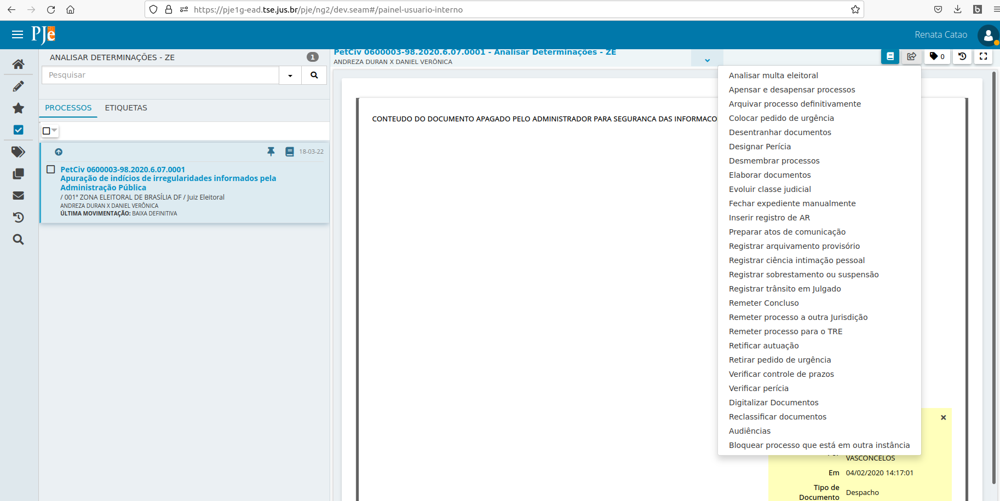
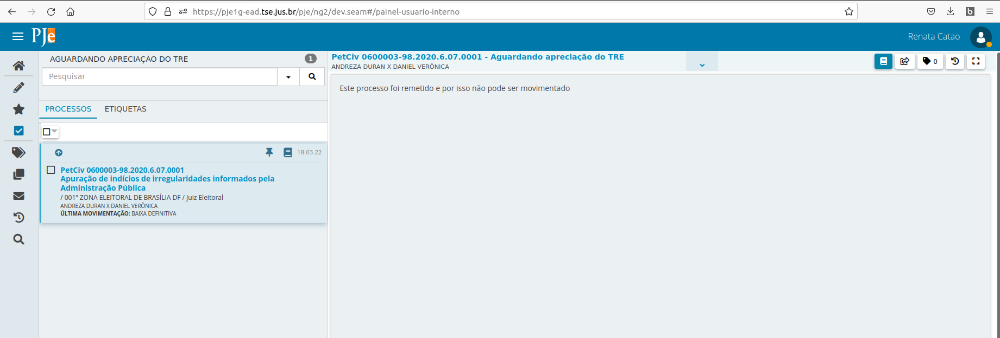
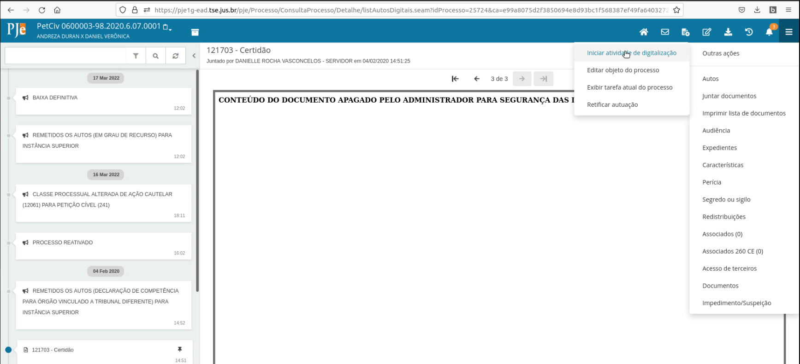
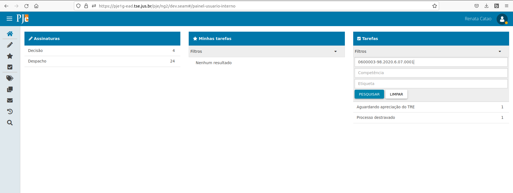
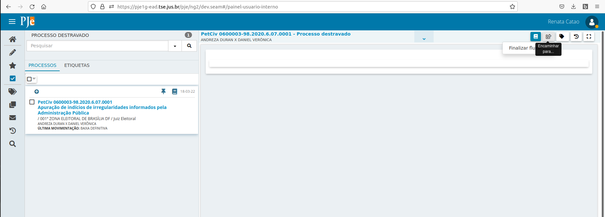
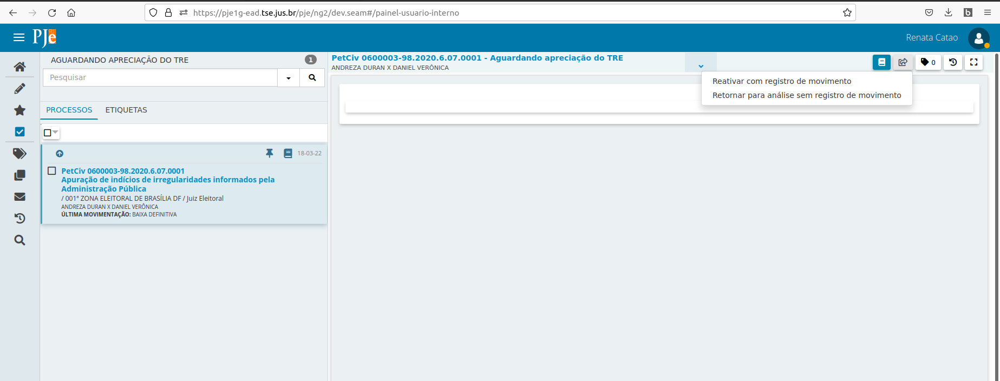
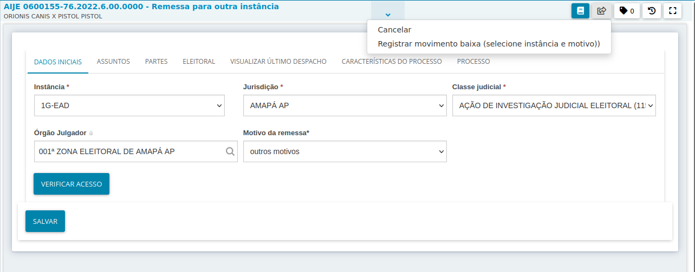
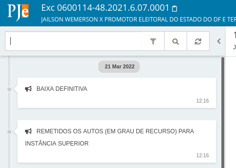

# Remessa

Aqui estarão agregadas informações para auxiliar os servidores da Justiça Eleitoral na remessa de processos entre instâncias. 

*IMPORTANTE!!!!!* : só utilize essas opções após ter certeza da situação dos processos nas duas instâncias envolvidas. AS INSERÇÕES DE MOVIMENTOS PROCESSUAIS NÃO PODERÃO SER DESFEITAS.

## Remessa concluída sem bloqueio de processo

Por vezes o servidor tenta realizar a remessa de um processo do ambiente do primeiro grau para o TRE e, apesar do processo chegar no ambiente do TRE, o sistema não bloqueia o processo de origem para tramitação e inclusão de documentos.

É importante que esse bloqueio ocorra para que novas informações sejam inseridas apenas na instância onde está ocorrendo a tramitação, no caso, no TRE. Caso o processo esteja na tarefa de finalização do envio (no exemplo acima, está), o servidor deve acionar a opção "Retornar para análise sem registro de movimento".

Para realizar o bloqueio, o usuário pode acionar a transição "Bloquear processo que está em outra instância" disponível a partir das tarefas de análise (Para o primeiro grau: Analisar processos, Analisar novo processo e Analisar determinação, urgentes ou não - Para as instâncias colegiadas: Verificar pendências).

Isso fará com que o processo seja tramitado para a tarefa respectiva de finalização do envio bloqueado para tramitação de petições.

Essas instruções também estão valendo para serem usadas nos TREs e no TSE. A tarefa onde o processo normalmente estará é a "Aguardando apreciação de outra instância".

## Processo não enviado e bloqueado 

Por vezes o servidor tenta realizar a remessa, o processo não chega na instância de destino, mas na instância de origem fica bloqueado para tramitação e peticionamento. 

Dessa forma, o servidor não consegue fazer uma nova tentativa de remessa. Para desbloquear o processo, o servidor deve abrir os autos e clicar na opção "Iniciar atividade de digitalização". 

O acionamento dessa opção retirará o bloqueio do processo e abrirá uma nova tarefa, denominada "Processo destravado". 

O servidor deve finalizar a tarefa.

Depois, é só tramitar o processo na tarefa principal em que ele se encontra já desbloqueado. Em geral o processo estará na tarefa de finalização do envio. Se for necessário o movimento de ativação, deve ser utilizada a opção "Reativar com registro de movimento". Se não for o caso de lançar movimentos, utilizar a opção "Retornar para análise sem registro de movimento". 

## Processo enviado que necessita movimentos de baixa

Algumas vezes pode ocorrer de o processo ser remetido à outra instância, mas os movimentos de baixa não serem lançados na origem. Nesse caso, o servidor pode fazer o lançamento dos movimentos. Para que os movimentos sejam lançados corretamente, o sevidor deve SEMPRE SELECIONAR O MOTIVO DA REMESSA E A INSTÂNCIA DE DESTINO. Se não selecionar o motivo da remessa, a transição apresentará erro e não será concluída. Se não selecionar a instância de destino, o sistema poderá atribuir um valor errado ao movimento e o MOVIMENTO NÃO PODERÁ SER AJUSTADO. 

Estando o processo na tarefa de remessa, ele deve selecionar a transição para finalização do envio com registro de movimento. 

No caso acima, a transição é "Aguardar TRE e registrar movimento de baixa (tem que informar motivo da remessa)". O motivo da remessa deve sempre ser informado nesse caso, já que o movimento de remessa é constituído também por essa informação, assim como a instância de destino.

## Processo desbloqueado que necessita movimentos de reativação

Pode acontecer de um processo retornar de uma outra instância via remessa e os movimentos de reativação não terem sido lançados. Nesse caso, a partir da tarefa de finalização do envio, o servidor pode acionar a transição "Reativar com registro de movimento".

O processo será encaminhado para a tarefa de análise e nos autos o movimento de reativação será lançado.

