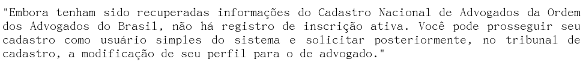

# Situação da inscrição do advogado na OAB

## Regras de negócio atuais do sistema

No cadastro inicial, o PJe consulta o Cadastro Nacional dos Advogados (CNA) pelo CPF para verificar se a pessoa esta cadastrada. São retornadas inscrições de advogados, suplementares e de estagiários. Apenas as em situação regular são consideradas.

Caso não exista inscrição ativa, a mensagem a seguir é mostrada para o usuário cadastrante:

Portanto o cadastro continua, porém como _jus postulandi_ apenas. No entanto, não há impedimento técnico no sistema para que um usuário interno do Tribunal torne essa pessoa um advogado e confirme seu credenciamento, mesmo sem número de inscrição na OAB.

A partir de então, o único momento em que é mostrada a situação da inscrição do advogado é na **retificação de autuação** ao lado do nome do advogado. É necessário que o usuário que esteja acessando a funcionalidade seja usuário interno do sistema, ou seja, seu papel atual for diferente de advogado, assistente de advogado, jus postulandi, perito, procurador ou assistente de procurador.

** Considerações finais **

Os dados apresentados tem apenas caráter informativo, mesmo que em situação irregular. Além disso, caso o advogado possua mais de uma inscrição regular, a informação acima é baseada apenas na primeira OAB encontrada, ignorando-se as demais. O que pode não refletir a exata situação cadastral do advogado.

Um advogado com a situação regular no momento do cadastro no PJe e que posteriormente teve sua inscrição cancelada e/ou tornada irregular, continua como regular no PJe até que um usuário interno do PJe, a partir da funcionalidade, **confirmar credenciamento do advogado**, utilize o botão **nova validação na OAB** para atualizar os dados do advogado.

Entretanto, a situação da inscrição da OAB do advogado causa impedimento apenas no momento do cadastro inicial do usuário. Uma vez cadastrado no sistema como advogado e independentemente da situação da inscrição em momento posterior, nenhum outro impedimento é feito. Ou seja, é permitido ao advogado protocolizar novos processos, juntar documentos e inclusive solicitar habilitação nos autos, mesmo que em situação irregular.

**Observação:** Já existem demandas (PJEVII-4416, PJEVII-3889, PJEVII-3173, PJEVII-4536 e PJEVII-4092) em andamento no Conselho Nacional de Justiça (CNJ)
que visam melhorias na funcionalidade e desenvolvimento de alertas para advogados penalizados.