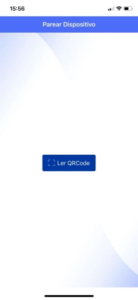
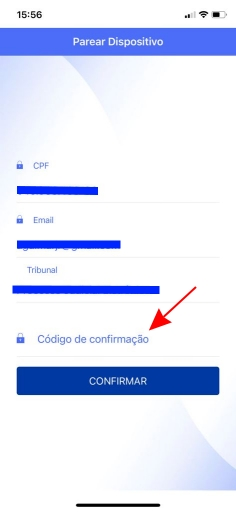
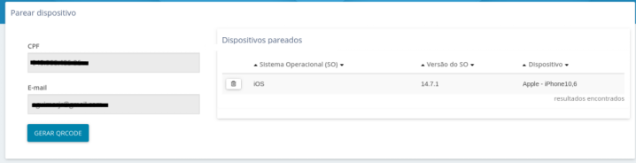

# Acesso Token Celular

## Como Fazer o Pareamento do Dispositivo

1. Baixe o aplicativo Token PJe para IPhone ou Android;
2. Entre no PJe do Tribunal;
3. No menu, escolha as opções **Configuração >> Mobile** e clique no botão **Gerar QRCode**;

    

    Você receberá um email com o código necessário para concluir o pareamento.

    

4. No celular, toque no botão **Ler QRCode** para fazer o pareamento do dispositivo;

    

5. Informe no celular o código recebido por e-mail;
    
    

6. Um novo e-mail será encaminhado confirmando o pareamento com sucesso;

    

7. No PJe, ao retornar ao menu, opções **Configuração >> Mobile**, constará o nome do dispositivo pareado.

    

