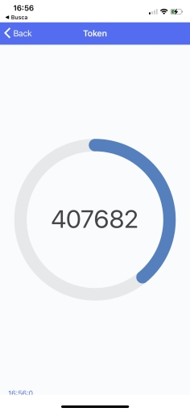
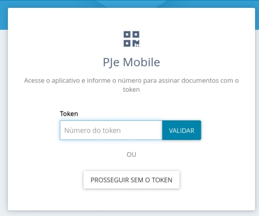

#  Token PJe (PJe Mobile)

Como utilizar a ferramenta que permite ao usuário logar no PJe e assinar documentos sem a necessidade do certificado digital em token físico.

## Como Fazer o Pareamento do Dispositivo

1. Baixe o aplicativo Token PJe para IPhone ou Android;
2. Entre no PJe do Tribunal;
3. No menu, escolha as opções **Configuração >> Mobile** e clique no botão **Gerar QRCode**;

    

    Você receberá um email com o código necessário para concluir o pareamento.

    

4. No celular, toque no botão **Ler QRCode** para fazer o pareamento do dispositivo;

    

5. Informe no celular o código recebido por e-mail;
    
    

6. Um novo e-mail será encaminhado confirmando o pareamento com sucesso;

    

7. No PJe, ao retornar ao menu, opções **Configuração >> Mobile**, constará o nome do dispositivo pareado.

    

8. Geralmente não é necessário realizar mais do que um pareamento.

## Como Logar com o Token Gerado no Celular

1. Abra o aplicativo *Token PJe* no celular e clique em **Token**. O sistema mostrará códigos númericos que serão utilizados no PJe;

    

2. No PJe, logue utilizando seu CPF e senha. Um caixa será exibida no sistema para informar o código númerico gerado pelo aplicativo do celular;

    

3. Retorne ao aplicativo do celular e verifique o último código gerado. Anote esse código
e informe-o***** na tela do PJe;

    *** Observação:** É importante digitar o código gerado antes que ele expire no aplicativo do celular.

4. Em seguida, clique em **Validar**. Verifique se a bolinha verde aparece ao lado do seu nome no canto superior direito do PJe. Em caso afirmativo, você está logado no PJe com o token digital e poderá assinar documentos no sistema sem a necessidade do certificado digital em token físico;

    

5. Por fim, nas tarefas do PJe que exijam a certificação digital do usuário, como por exemplo na assinatura de documentos, o sistema apresentará dois botões para efetivar a assinatura. Clique no botão **Assinar documentos(s) mobile** para efetivar a assinatura do documento.

    